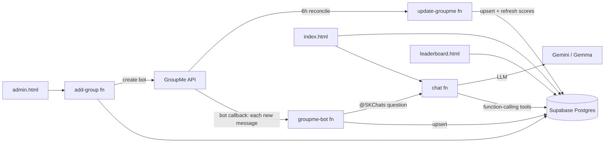

# GroupMe Archive

A full-history GroupMe archiving platform: every message from every group is stored in Postgres, browsable through a login-gated web dashboard, scored on a points leaderboard, and queryable in natural language by an AI archivist — in the dashboard and as a GroupMe bot (`@SKChats`).

Live app: [skchats.pages.dev](https://skchats.pages.dev)

---

## What it does

- **Archives** every message across many GroupMe groups — text, media, likes, join/leave/kick/rename events — into Supabase Postgres.
- **Ingests in real time**: the GroupMe bot callback writes each new message to the DB as it is posted (near-zero polling), reconciled by a 6-hour cron for anything missed.
- **Browses history** in a fast dashboard: windowed message viewer with keyset pagination, full-text search, multi-member filters, reply-quote rendering, clickable member profiles (nickname history, join order, role), an image lightbox, and a date/month jump-back rail.
- **Ranks members** on a points leaderboard (per-group and global) with day/week/month/year periods.
- **Answers questions** with an AI archivist (Gemini/Gemma + function-calling tools over the archive), both in the dashboard chat panel and from inside GroupMe via `@SKChats <question>`.
- **Self-serves administration**: an admin console adds groups, auto-creates the bot, backfills history, toggles local-only/blocklist/admin-room flags, and shows the AI question log.

## Architecture

Four Edge Functions sit over a Supabase Postgres archive, three static pages run on Cloudflare Pages, and a GroupMe bot rounds it out. Two writers keep the archive current: the bot callback ingests each message in real time, and a reconciliation cron backfills anything missed.



- **Supabase** — Postgres (messages, members, events, `member_scores`, `group_stats`, `ai_log`, `bots`, `admins`), Edge Functions (Deno/TypeScript), Auth (email/password, JWT sessions), pg_cron. Row-Level Security gates every table to authenticated users and confines cross-group reads.
- **Edge Functions** (`supabase/functions/`): `groupme-bot`, `update-groupme`, `chat`, `add-group`. See [docs/ARCHITECTURE.md](docs/ARCHITECTURE.md).
- **Frontend** — three static pages (Tailwind compiled and inlined, vanilla JS, no CDN, no build server) on Cloudflare Pages, deployed from GitHub `master`.

## Points economy

`+1` per message · `+20` per like received · `+10` per like given · `−25` per leave · `−500` per kick · `−5` per deleted message · `−350` per inactive month (all-time board only).

Bots are excluded; members below zero are ranked but hidden. The all-time board reads a materialized `member_scores` table (refreshed on sync); period boards (day/week/month/year) compute in-window from the `leaderboard()` SQL function. A global board sums points per user across all non-local groups. Details in [docs/ARCHITECTURE.md](docs/ARCHITECTURE.md#points).

## Repository layout

```
index.html            Dashboard (message browser + AI chat panel)
leaderboard.html      Points leaderboard (per-group + global)
admin.html            Admin console (add groups, sync, logs, flags)
dashboard.html        Original offline viewer (reads a local JSON archive)
supabase/
  functions/          Edge Functions: groupme-bot, update-groupme, chat, add-group
  migrations/         Ordered SQL schema + functions + RLS
scripts/              Python ops/setup utilities (run from the repo root)
tw.in.css tw.config.cjs   Tailwind source (compiled + inlined into the HTML)
docs/                 Architecture, setup, security, scripts, AI reference
```

## Quickstart

This repo is the source for a specific deployment, but it is a complete template. To stand up your own:

1. Create a Supabase project; apply the migrations (`supabase/migrations/`).
2. Set the function secrets and a local `.env` (see [docs/SETUP.md](docs/SETUP.md)).
3. Deploy the four Edge Functions.
4. Deploy the three HTML pages to Cloudflare Pages from your GitHub `master`.
5. Open `admin.html`, sign in as an admin, and add your first group — the bot is created and history backfilled automatically.

Full walkthrough: **[docs/SETUP.md](docs/SETUP.md)**.

## Documentation

| Doc | Contents |
|---|---|
| [docs/ARCHITECTURE.md](docs/ARCHITECTURE.md) | Components, data model, ingest paths, edge functions, points math |
| [docs/SETUP.md](docs/SETUP.md) | Deploy from scratch: Supabase, migrations, secrets, functions, Pages, bot, cron |
| [docs/SECURITY.md](docs/SECURITY.md) | Auth gate, admins table, RLS + cross-group isolation, `run_readonly`, secrets |
| [docs/AI.md](docs/AI.md) | The archivist: tools, prompt design, scope model, accuracy guardrails |
| [docs/SCRIPTS.md](docs/SCRIPTS.md) | Every script in `scripts/` with usage |
| [CHANGELOG.md](CHANGELOG.md) | Notable changes |

## Configuration

Secrets live in `.env` (git-ignored, never committed) and in Supabase function secrets — never in tracked source. Public, RLS-protected values (Supabase URL, anon key, project ref) do appear in the frontend by design. See [docs/SETUP.md](docs/SETUP.md#configuration) and [docs/SECURITY.md](docs/SECURITY.md).

## Rebuilding CSS

Tailwind is compiled and inlined (no CDN):

```bash
npx tailwindcss -c tw.config.cjs -i tw.in.css -o tw.out.css --minify
# then re-inject tw.out.css into the <style> block of each HTML page
```

## Author

Built by **Shalom Karr**.

- Website: [shalomkarr.pages.dev](https://shalomkarr.pages.dev)
- GitHub: [github.com/shalom-karr](https://github.com/shalom-karr)
- Forum: [forums.jtechforums.org/u/shalom_karr](https://forums.jtechforums.org/u/shalom_karr/)

Ask the SKChats bot "who built you?" and it will point here too.

## License

This project is **source-available, not open source**. It is licensed under the
**GNU Affero General Public License v3.0 (AGPL-3.0) with the Commons Clause** — see [LICENSE](LICENSE).

In short:

- **Copyleft (AGPL-3.0):** if you copy, modify, or build on any part of this code, you must release the complete corresponding source of your whole work under these same terms — including when you run a modified version as a network/hosted service.
- **No commercial or paid use (Commons Clause):** you may **not** "Sell" the software or use it — in whole or in part — in any paid, commercial, or revenue-generating product or service without a separate written commercial license.
- Personal, educational, research, and other non-commercial use is permitted, subject to the copyleft obligation.

**Commercial licensing:** a separate paid license is available. Open an issue at [github.com/Shalom-Karr/groupme-archive](https://github.com/Shalom-Karr/groupme-archive) to request commercial or paid-use permission.

© 2026 Shalom Karr. All rights reserved.
